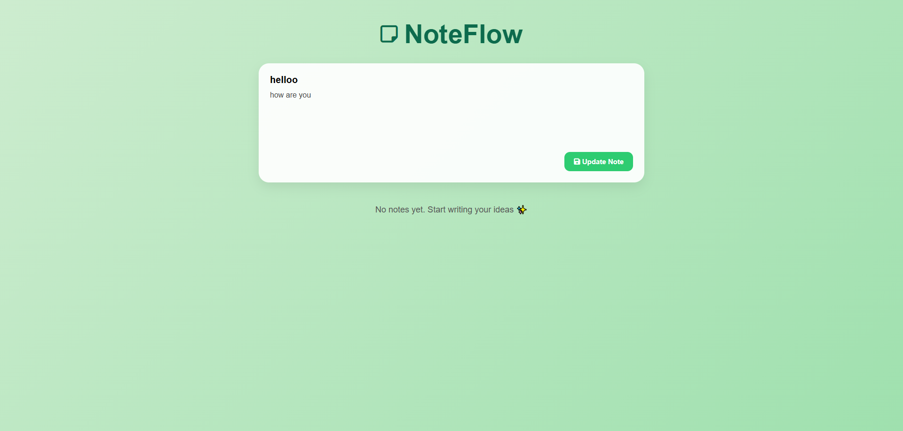
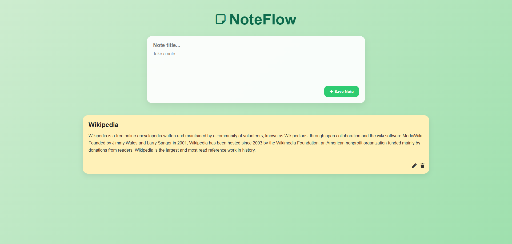
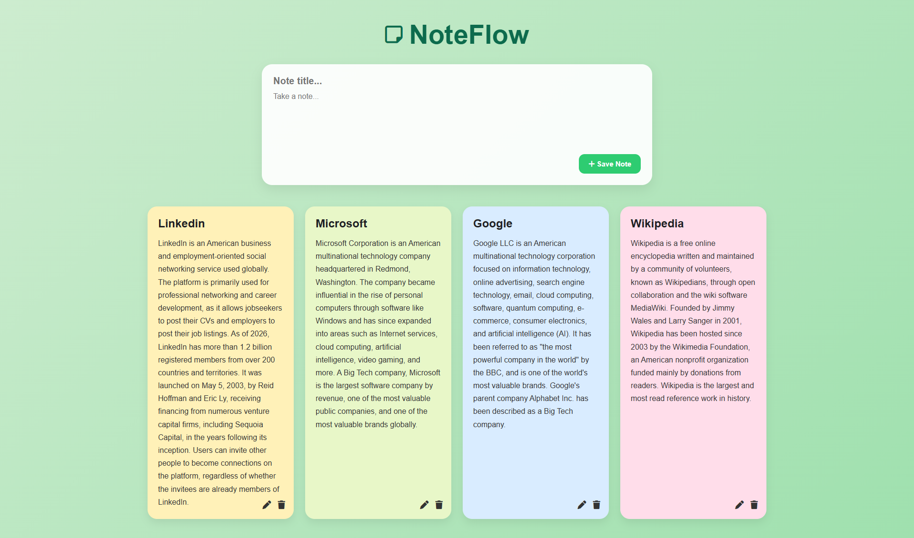
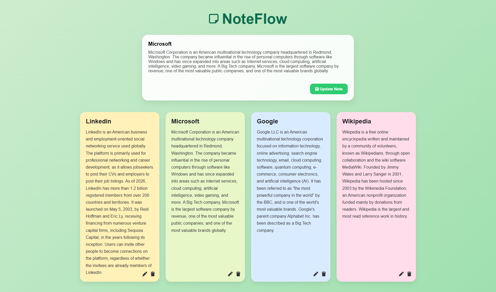
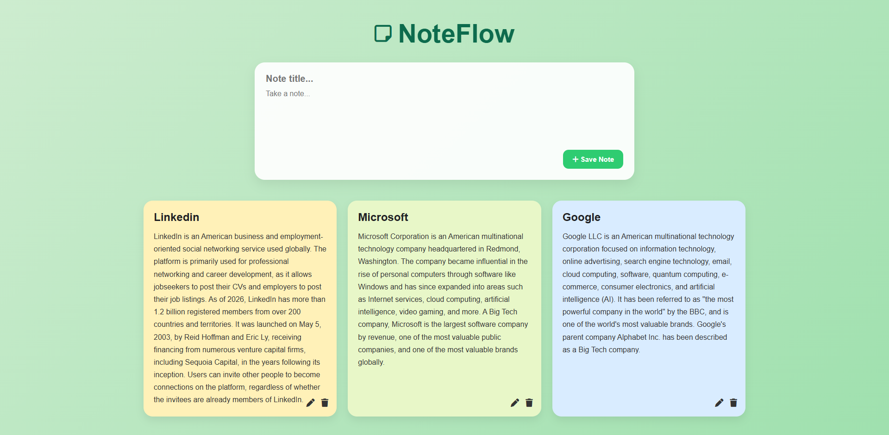

# 📝 NoteFlow

> A clean, minimal Google Keep-style notes app built with vanilla HTML, CSS & JavaScript.


---

## ✨ Features

- 📌 **Create Notes** — Add notes with a title and body text
- ✏️ **Edit Notes** — Update any existing note inline
- 🗑️ **Delete Notes** — Remove notes with a single click
- 🎨 **Color-coded Cards** — Notes cycle through 6 pastel color themes automatically
- 💾 **Persistent Storage** — All notes are saved to `localStorage` — no backend needed
- 📱 **Responsive Design** — Works on desktop, tablet, and mobile
- ⚡ **Zero Dependencies** — Pure HTML, CSS, and JavaScript — no frameworks, no build tools

---

## 🚀 Live Demo

> 🔗 [View Live on GitHub Pages](#) *(update this link after enabling GitHub Pages)*

---

## 📸 Screenshots

### Main Interface


### Adding Notes


### All Notes List


### Edit Notes


### Delete Feature


---

## 🗂️ Project Structure

```
NoteFlow/
├── index.html       # App markup & layout
├── style.css        # Styling, card colors, responsive rules
└── app.js           # Core logic: add, edit, delete, localStorage
```

---

## 🛠️ Getting Started

### Prerequisites

No setup required. Just a browser.

### Run Locally

```bash
# Clone the repository
git clone https://github.com/shahidchowdhurydev/NoteFlow.git

# Navigate into the project folder
cd NoteFlow

# Open in browser
open index.html
```

Or simply drag `index.html` into your browser window.

---

## 💡 How It Works

| Action | What Happens |
|---|---|
| Type title + text → click **Save Note** | A new note card is added to the top of the grid |
| Click ✏️ on a card | Form pre-fills with that note's data for editing |
| Click **Update Note** | The existing note is updated in place |
| Click 🗑️ on a card | The note is permanently deleted |
| Refresh the page | All notes are restored from `localStorage` |

---

## 🎨 Color Themes

Notes automatically cycle through 6 soft pastel card colors:

| Class | Color |
|---|---|
| `note1` | 🟡 Pale Yellow |
| `note2` | 🟢 Soft Green |
| `note3` | 🔵 Sky Blue |
| `note4` | 🩷 Light Pink |
| `note5` | 🟣 Lavender |
| `note6` | 🟠 Peach |

---

## 🔮 Planned Improvements

- [ ] Search / filter notes by keyword
- [ ] Pin important notes to the top
- [ ] Drag-and-drop reordering
- [ ] Dark mode toggle
- [ ] Export notes as `.txt` or `.pdf`
- [ ] Note character / word count

---

## 👨‍💻 Author

**Md. Shahid Chowdhury**
Full-Stack Developer (MERN) | EdTech Specialist

[](https://github.com/shahidchowdhurydev)
[](https://linkedin.com/in/shahidchowdhurydev)

---

## 📄 License

This project is open source and available under the [MIT License](LICENSE).

---

<p align="center">Made with ❤️ and vanilla JavaScript</p>
